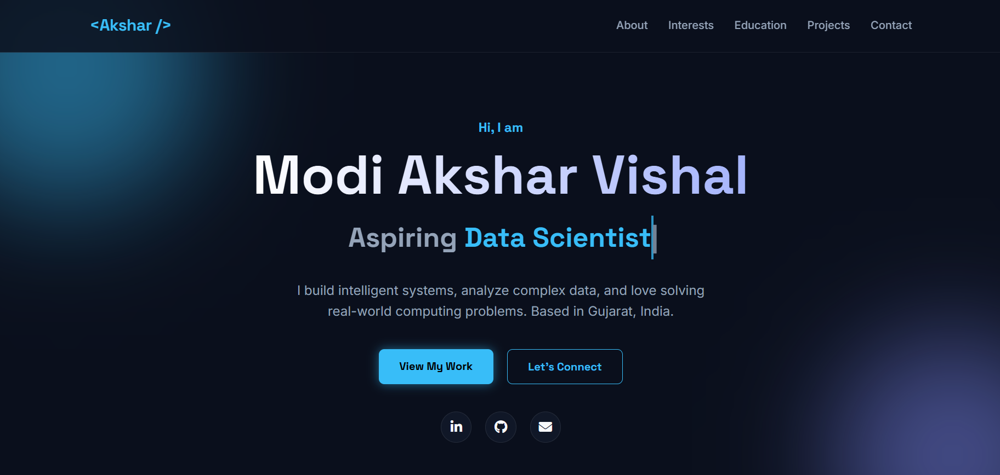

#  Modi Akshar Vishal - Personal Portfolio 👨‍💻

A modern, interactive, and fully responsive personal portfolio website built to showcase my skills, projects, and academic journey in **Data Science** and **Artificial Intelligence**.

 

## 🚀 Features
- **Premium Dark Aesthetics:** Built with a sleek, high-contrast dark theme utilizing glassmorphism (frosted glass) effects.
- **Interactive UI:** Smooth scrolling, intersection-observer triggered animations, and a dynamic typing effect in the hero section.
- **Custom Lightbox:** An interactive image viewer for professional certifications with built-in download functionality.
- **Fully Responsive:** Adapts seamlessly across desktop, tablet, and mobile displays.

## 🛠️ Tech Stack
- **Structure:** Semantic HTML5
- **Styling:** Custom CSS3 (CSS Variables, Flexbox, CSS Grid)
- **Interactivity:** Vanilla JavaScript (ES6+)
- **Icons & Typography:** FontAwesome & Google Fonts (Space Grotesk, Inter)

## 📫 How to reach me
- **Email:** classaxar@gmail.com
- **LinkedIn:** [Modi Akshar](https://www.linkedin.com/in/akshar-modi-099429395)
