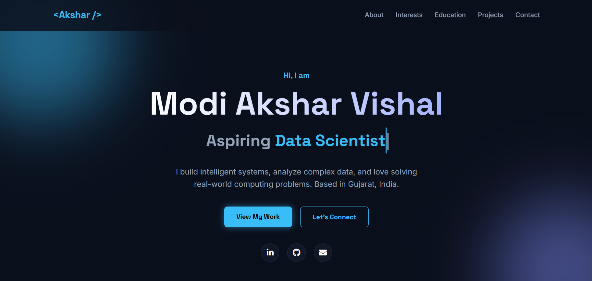

# Modi Akshar Vishal - Personal Portfolio 👨‍💻

A modern, interactive, and fully responsive personal portfolio website built to showcase my skills, projects, and academic journey as a **Full-Stack Developer**, **Backend Engineer**, and **Google Gemini Student Ambassador 2026**.

## 🚀 Features
- **Premium Dark Aesthetics:** Built with a sleek, high-contrast dark theme utilizing glassmorphism (frosted glass) effects.
- **Interactive UI:** Smooth scrolling, intersection-observer triggered animations, and a dynamic typing effect in the hero section.
- **Mobile Responsive Design:** Adapts seamlessly across desktop, tablet, and mobile displays, featuring a custom interactive hamburger dropdown menu for mobile navigation.
- **Project Showcase:** Highlights full-stack architectures (like CareerBridge), AI-driven applications, and Data Science analyses.
- **Custom Lightbox:** An interactive image viewer for professional certifications (including McKinsey, AWS, IBM, and more) with built-in download functionality.

## 🛠️ Tech Stack
- **Structure:** Semantic HTML5
- **Styling:** Custom CSS3 (CSS Variables, Flexbox, CSS Grid, Glassmorphism)
- **Interactivity:** Vanilla JavaScript (ES6+)
- **Icons & Typography:** FontAwesome & Google Fonts (Space Grotesk, Inter)

## 📫 How to reach me
- **Email:** classaxar@gmail.com
- **LinkedIn:** [Modi Akshar Vishal](https://www.linkedin.com/in/akshar-modi-099429395)
- **GitHub:** [classaxar](https://github.com/classaxar)
